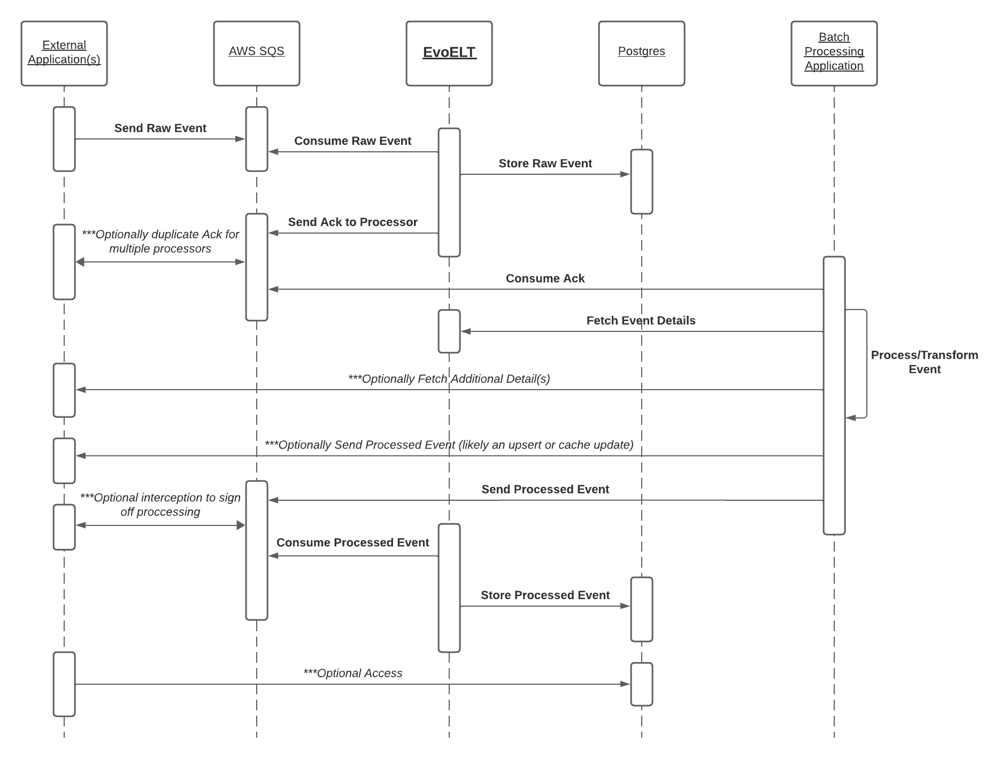
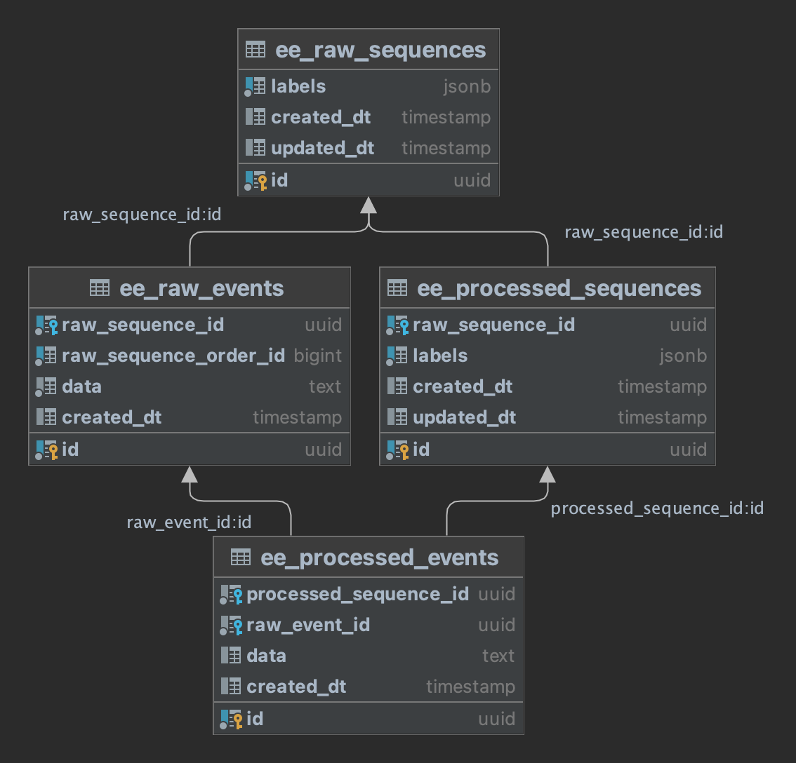

## About EvoELT
EvoELT is a dynamic Kotlin microservice prototyped for streamlining event processing in simulation games and other data-intensive applications. By bridging raw and processed event data, EvoELT empowers adaptable ELT (Extract, Load, Transform) flows that support real-time insights and retrospective data re-evaluation. Modeled for scalability and precision, EvoELT enhances gameplay optimization, event tracking, and pattern recognition in complex systems.

### Demo
EvoELT is demoed with [ELTsim](https://github.com/evelynkenenna/ELTsim), a UI tool for managing and analyzing activities from The Sims.

EvoELT empowers processing and transforming raw activity schedules. Insights are generated to suggest improvements to better metrics like happiness, energy, and relationship scores. Historical and real-time data empower players to make data-driven decisions for character optimization.

For more details, explore the [ELTsim](https://github.com/evelynkenenna/ELTsim).

### Technical Overview
#### Core Concepts
EvoELT’s architecture is built around event sequences, enabling flexible transformations:
- Raw Events: Input data representing actions, metrics, or states.
- Processed Events: Transformed data, such as aggregated statistics or anomalies detected.
- Sequences: Grouped events by labels, allowing structured analysis and processing.
#### Workflow Overview
- Event Submission: Raw events are sent to EvoELT through AWS SQS queues.
- Transformation: A processing application computes transformations.
- Data Storage: Raw and processed events are stored in a PostgreSQL database for querying and re-evaluation.

## Table of Contents
- [About EvoELT](#about-evoelt)
- [Use Cases](#architecture-and-uses)
- [DB Schema](#db-schema)
- [Event Data Flow](#event-data-flow)
- [Requirements](#requirements)
- [Testing & Running Locally](#testing--running-locally)
- [Dockerization](#dockerization)

## Architecture and Uses
### Definitions
- Raw Event: Input information
- Raw Sequence: Input information grouped by label
- Processed Event: Output information
- Processed Sequence: Output information grouped by label

*A single raw event may have multiple processed events.*

### High Level Architecture
In simulations, EvoELT acts as the bridge between raw data input and actionable insights. For example:

Input: A raw sequence of events, such as [A, AB, ABC, ABCD].
Processing: Transformation logic applied, yielding processed events [A, BA, CBA, DCBA].
Output: Anomalies and trends detected for actionable improvements.


### Medium Level Architecture
EvoELT supports a variety of gaming use cases:
- Transform player scores into scored and subscored leaderboards.
- Process historical player statistics to improve pairing algorithms in matchmaking.
- Analyze patterns to enhance player experience from in-game analytics.

### Low Level Architecture


Raw events are submitted with metadata and sequence labels *(optional)* via SQS. The batch/processing application retrieves sequences, applies transformations, and sends back processed events. These are stored and accessible through REST API endpoints, with support for pagination enabling historical reprocessing.

## DB Schema


*TODO: An option- if the `raw_sequence_order_id` becomes too large, overwrite previous events starting from 1, with the assumption that data this far back would break an algebraic model of understanding/is irrelevant OR add a key(s)/value(s) for consolidation; also consider swapping bigint for int. The current approach's assumption is that an AI/ML version number label would exist and get updated before reaching the number limit, creating a new raw sequence.*
## Event Data Flow
*data values will vary; these are examples with sample data to showcase structure*

### Raw Event -> Message Queue -> EvoELT
```json
{
  "labels": ["character_id-abc", "household_id-xyz", "activity_id-123"],
  "data": "{\"activity\": \"crafting\", \"duration_minutes\": 120, \"energy_cost\": 15, \"happiness_gain\": 30}"
}
```
Stored as a raw event, in a sequence based on label (must be an array, order does not matter)
***labels are optional

### EvoELT -> Message Queue -> Processing Application
```json
{
  "raw_event_id": "c87880c6-0506-49d1-a570-f50198f867fd",
  "raw_sequence_labels": ["character_id-abc", "household_id-xyz", "activity_id-123"]
}
```

### Processing Application -> REST API -> EvoELT
The transformation application should send a get request to EvoELT with a `raw_event_id` GET parameter, for example:
```
http://evoelt/lookup/raw/sequence?raw_event_id=c87880c6-0506-49d1-a570-f50198f867fd
```
returns

```json
{
  "labels": [
    "character_id-abc",
    "household_id-xyz",
    "activity_id-123"
  ],
  "events": [
    {
      "id": "c87880c6-0506-49d1-a570-f50198f867fd",
      "data": "{\"activity\": \"crafting\", \"duration_minutes\": 120, \"energy_cost\": 15, \"happiness_gain\": 30}",
      "order_id": 2,
      "created_dt": "2021-00-00 00:00:00.000000 +00:00"
    },
    {
      "id": "45f1af40-5d75-4375-b9f5-fe6d40b0a01a",
      "data": "{\"activity\": \"crafting\", \"duration_minutes\": 30, \"energy_cost\": 20, \"happiness_gain\": 10}",
      "order_id": 1,
      "created_dt": "2021-00-00 00:00:00.000000 +00:00"
    }
  ],
  "total_events": 2,
  "total_pages": 1,
  "pageable": {
    "page_offset": 0,
    "page_number": 0,
    "page_size": 100,
    "sort": "rawSequenceOrderId: DESC"
  }
}
```

The raw event and all predecessors in the raw sequence are returned.

Additional GET query parameters exist for pagination. The key is below:

| Parameter Name | json key    | Default Value |
|----------------|-------------|---------------|
| page           | page_number | 0             |
| size           | page_size   | 100           |

Use `total_pages` and `page_number` to paginate.

### Processing Application -> Message Queue -> EvoELT
```json
{
  "labels": [
    "character_id-abc",
    "household_id-xyz",
    "activity_id-123",
    "transformation_version-1.0.0"
  ],
  "raw_event_id": "c87880c6-0506-49d1-a570-f50198f867fd",
  "data": "{\"average_energy_cost\": 17.5, \"total_happiness_gain\": 40}"
}
```
Stored as a processed event in a sequence based on labels; same/different data can be stored with different labels.

## Requirements
- postgres
- AWS SQS FIFO Queue /w a dead-letter queue for the consumption queue

## Testing & Running Locally
Run the following commands, execute:
```
docker network create myNetwork
docker run -p 4566:4566 -d --env DEBUG=1 --env EAGER_SERVICE_LOADING=1 --network myNetwork --name localstack localstack/localstack:3.6.0
docker run -p 5432:5432 -d --env POSTGRES_PASSWORD=password --network myNetwork --name postgres postgres:16
```
Then setup:
- postgres:16
  - Populate the `evoelt` schema under the `postgres` database with SQL in `app/db/init.sql`
- localstack/localstack:3.6.0
  - CLI Commands:
    - `awslocal sqs create-queue --queue-name EVOELT_CONSUMER.fifo --attributes "FifoQueue=true"`
    - `awslocal sqs create-queue --queue-name EVOELT_PRODUCER.fifo --attributes "FifoQueue=true"`
    - `awslocal sqs create-queue --queue-name dead-letter-queue`
    - `awslocal sqs set-queue-attributes --queue-url http://sqs.us-east-1.localhost.localstack.cloud:4566/000000000000/EVOELT_CONSUMER.fifo --attributes '{"RedrivePolicy": "{\"deadLetterTargetArn\":\"arn:aws:sqs:us-east-1:000000000000:dead-letter-queue\",\"maxReceiveCount\":\"1\"}"}'`

Now local runs and tests will work.

## Dockerization
```
gradle bootBuildImage
docker run -d -p 8080:8080 --env DB_URL --env QUEUE_ENDPOINT=http://localstack:4566 --env DB_URL=jdbc:postgresql://postgres:5432/postgres --env AWS_ACCESS_KEY_ID=sample --env AWS_SECRET_ACCESS_KEY=test --env AWS_REGION=us-east-1 --network myNetwork --name=evoelt org.kenenna/evoelt:latest
```
### Environment Variables

| Variable             | Description                   | Default        | Required |
|----------------------|-------------------------------|----------------|----------|
| `DB_URL`             | Database URL                  | jdbc:postgresql://localhost:5432/postgres             | Yes      |
| `DB_SCHEMA`          | Database Schema               | evoelt             | Yes      |
| `DB_USERNAME`        | Database user                 | postgres             | Yes      |
| `DB_PASSWORD`        | Database password             | password             | Yes      |
| `QUEUE_ENDPOINT`     | Message Queue Endpoint        | http://localhost:4566             | Yes      |
| `CONSUMER_QUEUE_URL` | Message queue for listening | EVOELT_CONSUMER.fifo             | Yes      |
| `PRODUCER_QUEUE_URL` | Message queue for sending ack | EVOELT_PRODUCER.fifo             | Yes      |
| `AWS_ACCESS_KEY_ID` |  |              | Yes      |
| `AWS_SECRET_ACCESS_KEY` |  |              | Yes      |
| `AWS_REGION` |  |              | Yes      |